<p align="center">
  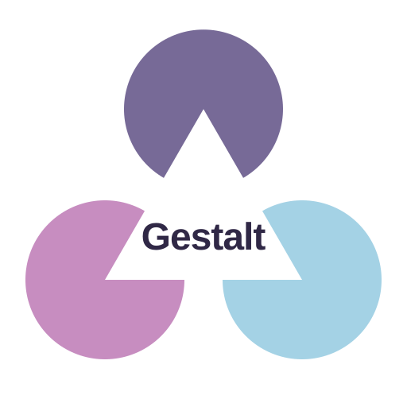
</p>

<h1 align="center">Gestalt: Large Multimodal Interplay Model</h1>

<p align="center">
  <a href="https://gewu-lab.github.io/Gestalt/"></a>
  <a href="#"></a>
  <a href="https://github.com/GeWu-Lab/Gestalt"></a>
  <a href="https://huggingface.co/GeWu-Lab/Gestalt"></a>
  <a href="#"></a>
</p>

<p align="center">
  <a href="https://ai.ruc.edu.cn/">GeWu-Lab, Gaoling School of Artificial Intelligence, Renmin University of China</a>
</p>

> **Gestalt** is a new paradigm of large multimodal model built around **multimodal interplay**. Guided by a multimodal interplay pyramid — from modality-specific modeling, through cross-modal alignment, to multimodal synergy — Gestalt adopts a unified **discrete diffusion** framework with an interplay-partitioned architecture, where learnable interplay tokens mediate cross-modal exchange and integration. The name is inspired by Gestalt psychology: *the whole is greater than the sum of its parts.*

<p align="center">
  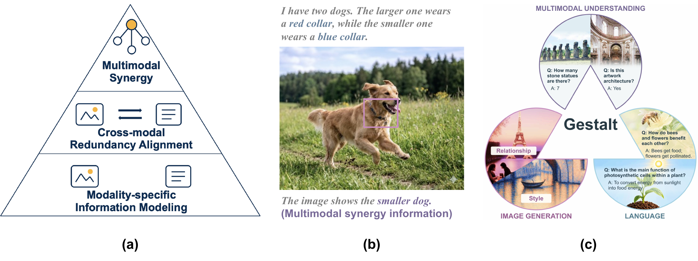
</p>

## 📢 News

- **[2026-09-30]** 🎉 We release the [model weights](https://huggingface.co/GeWu-Lab/Gestalt) and the training & inference code of Gestalt.
- 📄 The arXiv paper is coming soon. <!-- arXiv currently on hold; add link once announced -->

## 🧩 The Multimodal Interplay Pyramid

Multimodal intelligence grows from preserving what each modality knows to discovering what they can reveal together. We organize multimodal modeling as a bottom-up progression:

<p align="center">
  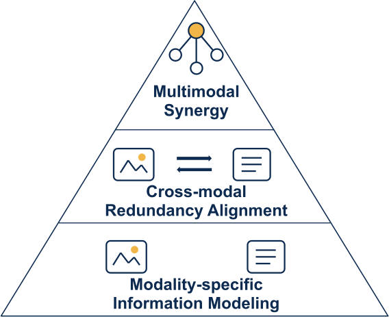
</p>

- **Modality-Specific Information Modeling** — preserve information available only in one modality, providing the foundation for multimodal learning.
- **Cross-Modal Redundancy Alignment** — align shared information across modalities to establish cross-modal correspondence.
- **Multimodal Synergy** — combine complementary cues to derive information that neither modality provides alone.

> *A case study:* “I have two dogs. The larger one wears a red collar, while the smaller one wears a blue collar.” The image provides the collar color; the text links collar color to size. **Together, they identify the smaller dog.**

## 🏗️ Architecture: From Controlled Exchange to Full Interplay

Gestalt brings vision and language into a shared discrete diffusion framework. The Transformer is divided into two successive zones, with **learnable interplay tokens** mediating cross-modal information flow throughout:

<p align="center">
  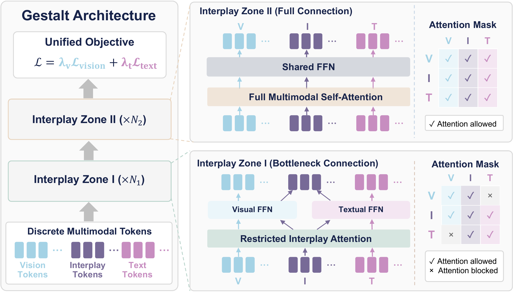
</p>

- **Interplay Zone I — Bottleneck Interplay.** Separate visual and textual FFNs preserve each modality’s information; direct cross-modal attention is restricted, and exchange is mediated by the interplay tokens.
- **Interplay Zone II — Full Multimodal Interplay.** The restriction is removed: image, text, and interplay tokens interact through full multimodal self-attention and a shared FFN, integrating complementary information across all tokens.

The two zones instantiate the pyramid as a progression from modality-specific processing, through controlled exchange, to full multimodal integration.

## 📚 Training: Multimodal Pretraining and Interplay Curriculum

| Stage | Data | Objective |
|:--|:--:|:--|
| **Multimodal Pretraining** | 70M | Joint masked prediction |
| **Continual Pretraining** | 8M | Conditional masked prediction |
| **Supervised Fine-Tuning** | 13.7M (+≈2.5M T2I) | Four interplay categories, three-phase curriculum |

The SFT data are organized into **redundant, text-unique, visual-unique, and synergistic** categories. Across three curriculum phases, all four categories are retained while the sampling emphasis progressively shifts — from consolidating cross-modal alignment and modality-specific capability, to deeper multimodal synergy.

<p align="center">
  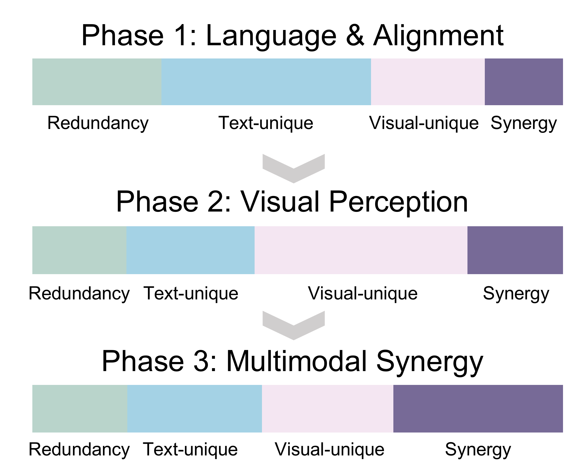
</p>

## 🔥 Quick Start

### 1️⃣ Environment

```bash
git clone https://github.com/GeWu-Lab/Gestalt.git
cd Gestalt
pip install -r requirements.txt
```

### 2️⃣ Download the Model

```bash
huggingface-cli download GeWu-Lab/Gestalt --local-dir /path/to/checkpoint
```

### 3️⃣ Training (Stage-III SFT)

Training data are Parquet files with a unified schema covering **I2T / MMU**, **T2I**, and **I2I** tasks (see [Data Format](#-data-format)):

```bash
DATA_DIR=/path/to/parquet \
PRETRAINED=/path/to/checkpoint \
NPROC_PER_NODE=8 \
scripts/training/gestalt_sft.sh
```

The checkpoint directory must contain `tokenizer.json`; training reads the tokenizer directly from `PRETRAINED`. Defaults: `configs/training/gestalt_stage_3.yaml` with DeepSpeed ZeRO-2 (`DEEPSPEED=none` to disable). Omit `NPROC_PER_NODE` for single-GPU runs. The number of Parquet files must be ≥ the number of distributed ranks.

### 4️⃣ Inference

**Multimodal understanding (MMU)** — image tokens + question → text:

```bash
python scripts/inference/run_mmu.py \
  --model /path/to/checkpoint \
  --image-tokens image_tokens.npy \
  --question "What is in this image?" \
  --token-h 32 --token-w 32
```

**Text-to-image (T2I)** — text → VQVAE tokens:

```bash
python scripts/inference/run_t2i.py \
  --model /path/to/checkpoint \
  --prompt "A cat sitting on a windowsill" \
  --output output_tokens.npy \
  --lat-h 32 --lat-w 32
```

> [!TIP]
> T2I uses an empty system prompt by default, matching the training template. If your training data used a fixed non-empty system prompt, pass the same text via `--system-prompt` at inference.

## 📦 Data Format

Training input is a Parquet file (or a directory of Parquet files) with a unified schema:

| Field | I2T | T2I | I2I |
|:--|:--:|:--:|:--:|
| `task_type` | `i2t` | `t2i` | `i2i` |
| `metadata_json` | JSON string | JSON string | JSON string |
| `conversations` | JSON string / turn list | — | — |
| `img_tokens` | raw VQVAE IDs | — | — |
| `system_prompt` | optional | string | string |
| `user_prompt` | — | string | string |
| `input_image_tokens` | — | — | raw VQVAE IDs |
| `answer_image_tokens` | — | raw VQVAE IDs | raw VQVAE IDs |

`metadata_json` must provide the image token grid — `token_height` / `token_width` for I2T & T2I; `input_/output_token_height` and `_width` for I2I; multi-image I2T can use `images: [{"token_height": H, "token_width": W}, ...]`. Image tokens must be **either** all raw VQVAE IDs in `[0, 16384)` **or** all model-space IDs in `[126356, 142740)` — never mixed.

## 📊 Benchmarks

### 🎨 Fine-Grained Text-to-Image Generation

<p align="center">
  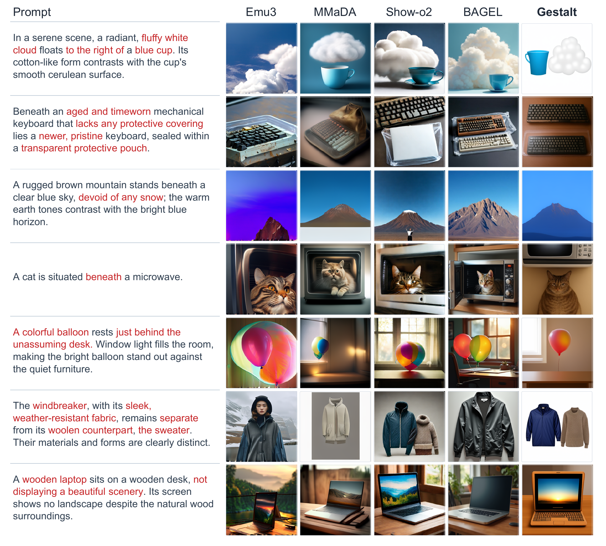
</p>

**UniGenBench** — Gestalt achieves the strongest overall result among the evaluated models, combining fine-grained semantic alignment with compositional generation.

<p align="center">
  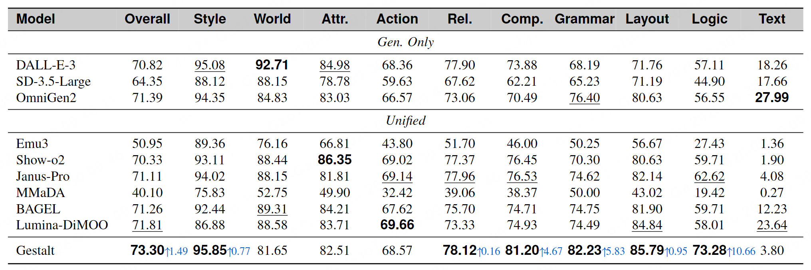
</p>

**TIIF-Bench** — Gestalt leads across short and long instructions, with a larger advantage when longer prompts introduce more interdependent requirements.

<p align="center">
  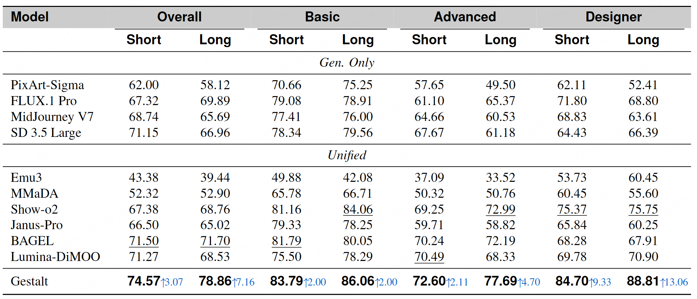
</p>

### 👁️ Multimodal Understanding

The gains on vision-centric tasks reflect the value of preserving modality-specific information within a unified model.

<p align="center">
  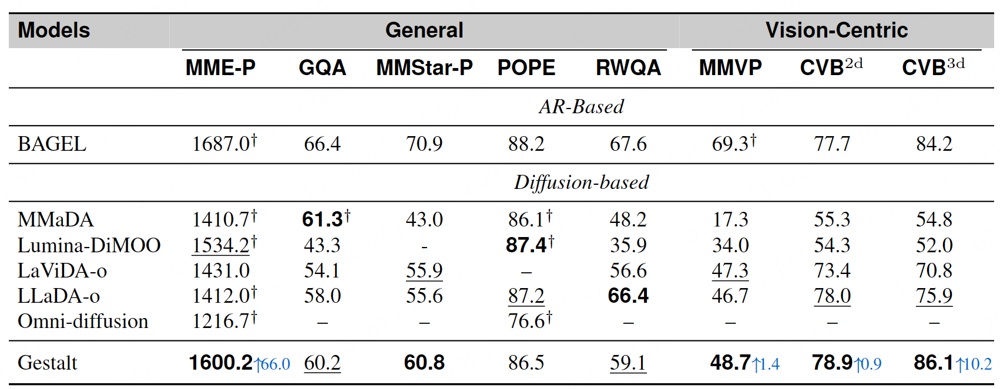
</p>

### 📝 Language

Gestalt leads the evaluated diffusion-based unified models and achieves language performance comparable to autoregressive models such as Janus-Pro.

<p align="center">
  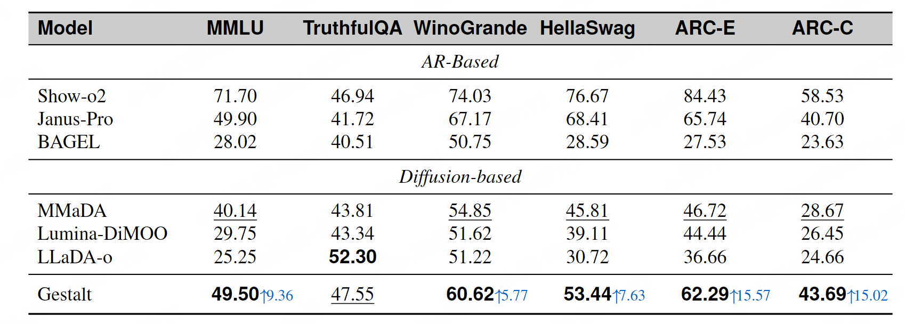
</p>

### 🔗 Multimodal Interplay

Visual and textual tokens are more interleaved in Gestalt, suggesting a more integrated representation space than the evaluated diffusion-based and autoregressive baselines.

<p align="center">
  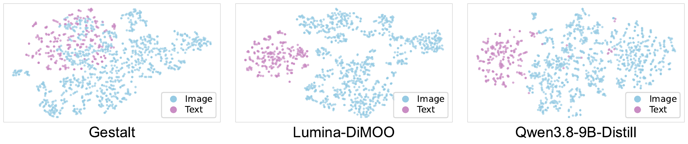
</p>

**Visual-specific and synergistic capability** — strong visual-specific performance is paired with leading synergy results among the evaluated diffusion-based models.

<p align="center">
  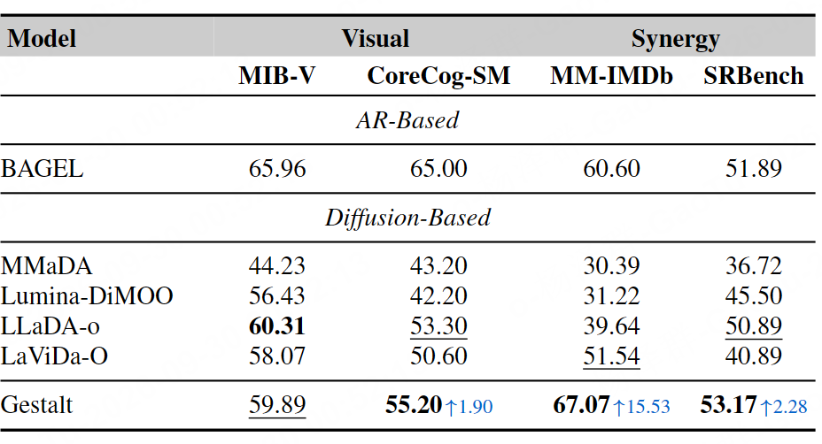
</p>

**Interplay-aware representations** — interplay tokens form distinct visual-unique, text-unique, and synergistic structures; the synergy distribution partially bridges the other two, suggesting that these tokens adapt to different information demands.

<p align="center">
  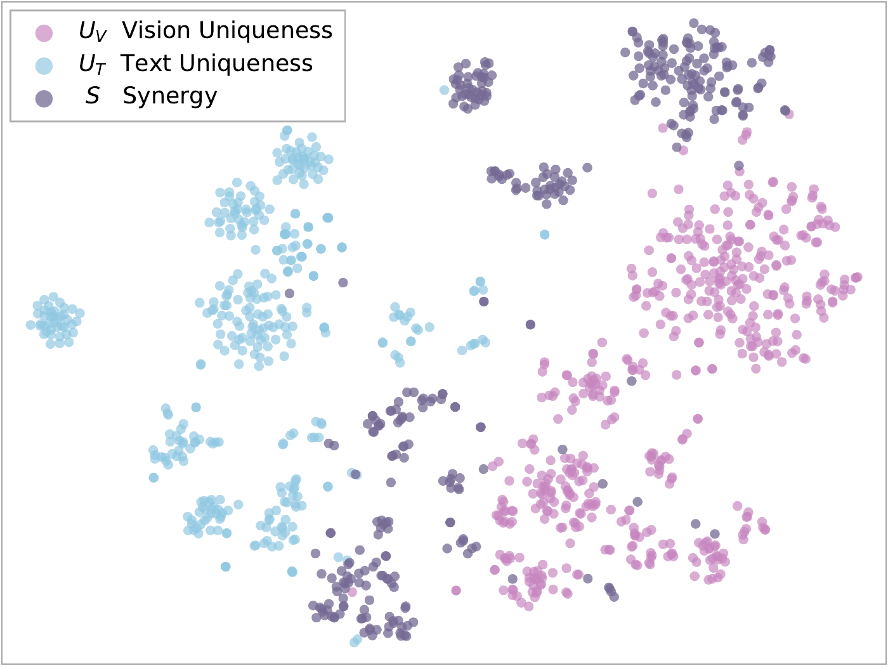
</p>

## ✍️ Citation

If you find Gestalt useful for your research, please cite:

```bibtex
@article{gestalt2026,
  title   = {Gestalt: Large Multimodal Interplay Model},
  author  = {Yang, Zequn and Miao, Yu and Ni, Haotian and Chen, Ziheng and
             Huang, Chengxiang and Zhou, Dongzhan and Chen, Kai and Zhang, Qi and
             Wen, Ji-Rong and Wei, Yake and Hu, Di},
  year    = {2026},
  url     = {https://github.com/GeWu-Lab/Gestalt}
}
```

## 📜 License

This project is released under the Apache 2.0 license. <!-- TODO: confirm license -->

## 🙏 Acknowledgements

Gestalt is developed by [GeWu-Lab](https://gewu-lab.github.io/) at the Gaoling School of Artificial Intelligence, Renmin University of China, in collaboration with Shanghai Artificial Intelligence Laboratory, Imperial College London, Beijing University of Posts and Telecommunications, and AresoX. Part of this work was done during internships at Shanghai Artificial Intelligence Laboratory.
